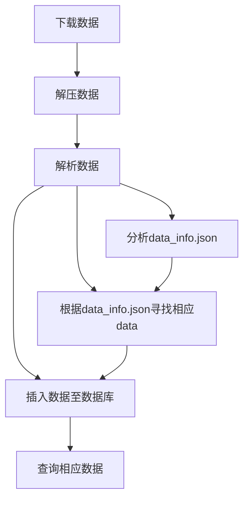

#	数据清洗
1.数据下载		
2.数据清洗			
3.数据存储			
4.数据应用		

##	数据下载	
url、button	
下载路径		
数据过大，采用分块下载	
多线程运行		
##	交互
数据下载	储存包名和hash	自增ID
后续使用ID进行管理	
##	数据存储
###	版本一	
jpg存路径、存时间戳		
点云二进制存路径、存文件大小、存时间戳		
四条json数据直接存json数据	
##	sql	
	