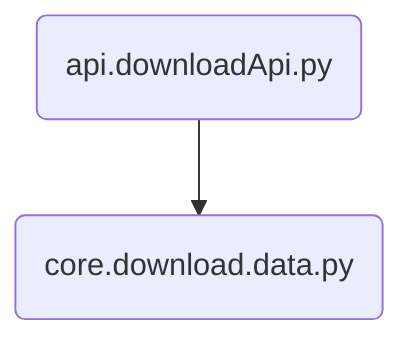

#	数据清洗	
##	整体架构

##	数据库设计	
主表
| Command | Description | 
| 列名 | 数据类型 | 约束 | 描述 |
| data_package_id | int | auto_increment primary key | 数据包ID，称例如single-vehicle-side-example为一个数据包 |
| data_package_name | varchar(50) | not null | 数据包名称 |
| data_package_hash | varchar(64) | not null | 数据包哈希，采用sha64进行哈希，以便于判断数据包是否重复 |
| data_package_type | int | not null | 数据包类型，例如该数据包为车端3D数据 |
	
vehicle_end_3D_inspection表
|列名|数据类型|约束|描述|
|id|int|auto_increment primary key|数据ID|
|data_package_id|int|not null|对应数据包ID|
|image_path_router|varchar(100)||图像文件路径，可以通过http下载的|
|image_path_timestamp|timestamp||图像文件获取时间|
|pointcloud_router|varchar(100)||点云文件路径|
|pointcloud_timestamp|timestamp||点云文件获取时间|
|pointcloud_size|int unsigned||点云文件大小|
|calib_camera_intrinsic_path|json||相机内参文件的JSON内容|
|calib_lidar_to_camera_path|json||激光雷达到相机的校准文件的JSON内容|
|label_camera_std_path|json||相机标准标签文件的JSON内容|
|label_lidar_std_path|json||激光雷达标准标签文件的JSON内容|

	
##	代码结构	
```
APP
├── main.py
├── api
│   ├──analysisApi.py	//解析数据的API
│   ├──downloadApi.py	//下载和解压数据的API
│   ├──searchApi.py		//搜索数据的API
├──core
│   ├──analysis
│   │    ├──analysis.py	//针对数据类型进行划分
│   │    ├──vehicleEnd3DInspectionAnalysis.py	//针对车端3D数据进行解析并保存至数据库
│   ├──db
│   │    ├──config.py	//数据库的基本配置
│   │    ├──connection.py	//连接数据库
│   ├──download
│   │    ├──data.py		//多线程下载zip数据、解压
│   │    ├──html.py		//第三周的下载html的作业，写了单线程下载、单线程流式下载、单线程分片流式下载、多线程下载
│   ├──search
│   │    ├──search.py	//从数据库搜索数据
├──models
│   ├──analysis
│   │    ├──dataInfoModel.py		//数据信息的父类，例如车端3D数据Model、路段3D数据Model均继承该类
│   │    ├──vehicleEnd3DInspectionDataInfoModel.py	//车端3D数据Model
│   ├──db
│   │    ├──dataPackageModel.py	//利用sqlAlchemy，数据包的Model
│   │    ├──vehicleEnd3DInspectionDBModel.py	////利用sqlAlchemy，车端3D数据针对数据库的Model
│   ├──download
│   │    ├──downloadDataModel.py	//下载ZIP文件的API中输入的Model
│   │    ├──downloadHtmlModel.py	//下载Html的API中输入的Model
├──tests
│   ├──core
│   │    ├──analysis
│   │    │    ├──test_analysis.py		//测试analysis.py
│   │    │    ├──test_vehicleEnd3DInspectionAnalysis.py	//测试vehicleEnd3DInspectionAnalysis.py
│   │    ├──db
│   │    │    ├──test_connection.py	//测试数据库connection.py
├──utils
│   ├──response
│   │    ├──responseEnum.py		//response的枚举
│   │    ├──responseUtil.py		//response的规范
│   ├──downloadUtils.py		//包括下载的通用函数，例如包括判断路径是否合法
│   ├──exception.py			//exception的创建
│   ├──serverConfig.py		//服务器的基本配置
```
##	下载、解压数据		
